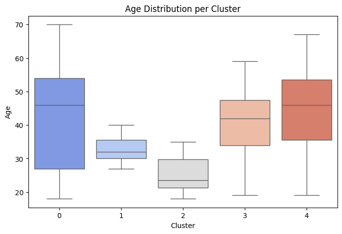
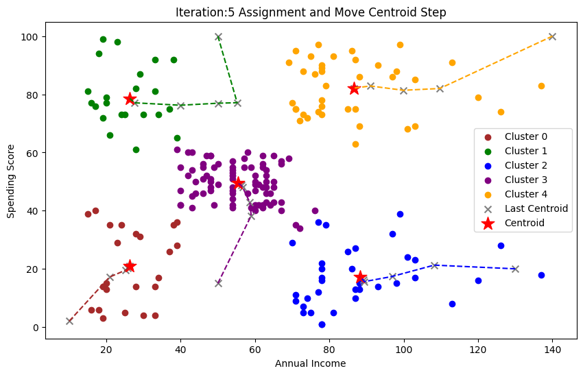
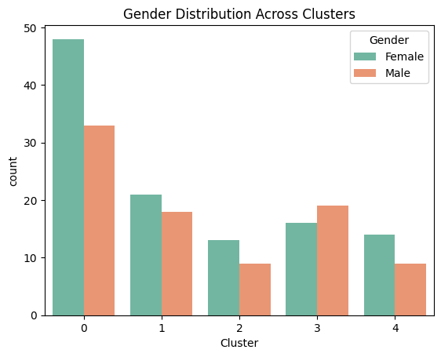
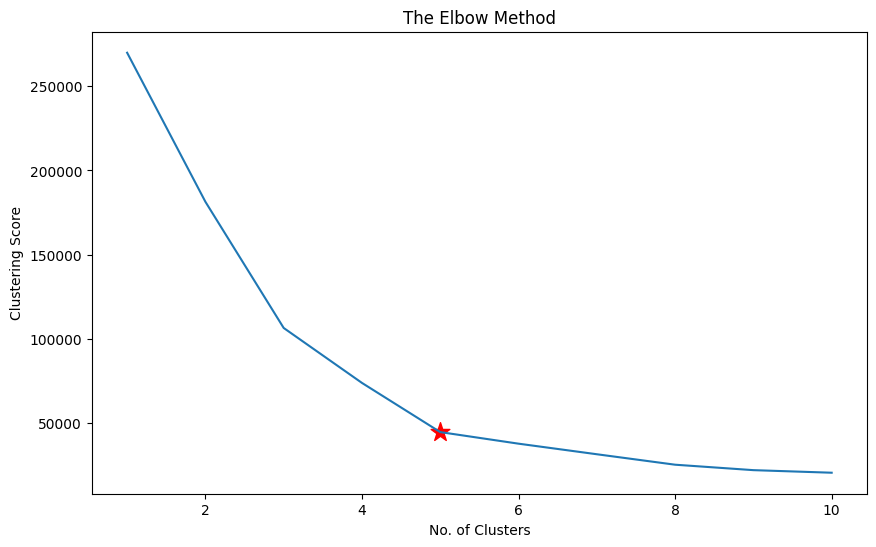

#  Customer Segmentation Analysis using K-Means Clustering



##  Project Overview
This project performs **customer segmentation analysis** on mall customer data using the **K-Means clustering algorithm**.  
The goal is to identify distinct customer groups based on their demographics and spending behavior to enable **targeted marketing strategies**.

---

##  Dataset
**Size:** 200 customers  
**Features:**
- **CustomerID** – Unique identifier for each customer  
- **Gender** – Male/Female  
- **Age** – Customer age in years  
- **Annual Income (k$)** – Annual income in thousands of dollars  
- **Spending Score (1–100)** – Score assigned based on customer behavior and spending nature  

---

##  Methodology
### 1. Data Preprocessing
- Loaded and explored the customer dataset  
- Checked for missing values and data quality  
- Prepared features for clustering analysis  

### 2. Optimal Cluster Selection
- Applied the **Elbow Method** to determine the optimal number of clusters  
- Analyzed the clustering score vs number of clusters  
- Selected **5 clusters** based on the elbow point  



### 3. K-Means Clustering
- Implemented K-Means with **5 clusters**  
- Visualized cluster formation and centroid movement  
- Plotted customer segments based on **Annual Income** vs **Spending Score**



### 4. Cluster Analysis
- Analyzed **age distribution** across clusters using box plots  
- Examined **gender distribution** within each cluster  



---

##  Key Visualizations
1. **Elbow Method Plot:** Shows optimal cluster selection at k=5.  
2. **Customer Segmentation Plot:** 2D visualization of clusters and centroids.  
3. **Age Distribution:** Variation in age across clusters.  
4. **Gender Distribution:** Gender ratio per segment.  

---

##  Business Insights

### 🟢 Cluster 0: Middle-Income, Moderate Spenders
- Size: 81 customers (40.5%)  
- Gender: 59% Female, 41% Male  
- Age Range: 18–70 (Median ~47)  
- **Marketing Strategy:** Seasonal offers, loyalty programs, and family-oriented campaigns.

### 🟡 Cluster 1: Middle-Income, High Spenders
- Size: 39 customers (19.5%)  
- Gender: 54% Female, 46% Male  
- Age Range: 27–40 (Median ~32)  
- **Marketing Strategy:** Exclusive deals, credit options, influencer campaigns.

### 🔵 Cluster 2: Low-Income, Low Spenders
- Size: 22 customers (11%)  
- Gender: 59% Female, 41% Male  
- Age Range: 18–35 (Median ~24)  
- **Marketing Strategy:** Discounts, referral programs, entry-level products.

### 🟣 Cluster 3: High-Income, Low Spenders
- Size: 35 customers (17.5%)  
- Gender: 46% Female, 54% Male  
- Age Range: 18–60 (Median ~42)  
- **Marketing Strategy:** Value-based messaging, personalized service, premium education content.

### 🔴 Cluster 4: High-Income, High Spenders
- Size: 23 customers (11.5%)  
- Gender: 61% Female, 39% Male  
- Age Range: 18–67 (Median ~46)  
- **Marketing Strategy:** VIP programs, luxury products, exclusive experiences.

---

##  Marketing Recommendations

###  Priority Segments
- **Cluster 4:** Maximize revenue via premium offerings  
- **Cluster 1:** Focus on retention and upselling  

###  Growth Opportunities
- **Cluster 3:** High income, low spenders → untapped potential  
- **Cluster 2:** Young customers → future high-value segment  

###  Segment-Specific Tactics
- **Female-dominated clusters (0, 2, 4):** Emphasize female-focused campaigns  
- **Male-dominated (3):** Tailor product mix to male preferences  
- **Younger segments (1, 2):** Digital-first, influencer strategies  
- **Older segments (0, 3, 4):** Multi-channel, value-driven messaging  

---

##  Segment Summary

| Cluster | Size | % of Total | Gender Split | Income | Spending | Value |
|:--------:|:----:|:-----------:|:-------------:|:--------:|:-----------:|:--------:|
| 0 | 81 | 40.5% | 59% F / 41% M | Middle | Moderate | Stable Revenue Base |
| 1 | 39 | 19.5% | 54% F / 46% M | Middle | High | High Growth Potential |
| 2 | 22 | 11.0% | 59% F / 41% M | Low | Low | Future Investment |
| 3 | 35 | 17.5% | 46% F / 54% M | High | Low | Unlock Opportunity |
| 4 | 23 | 11.5% | 61% F / 39% M | High | High | Premium Revenue |

---

##  Technologies Used
- **Python 3.x**  
- **pandas** – Data manipulation  
- **NumPy** – Numerical analysis  
- **scikit-learn** – Machine learning (K-Means)  
- **Matplotlib** – Visualization  
- **Seaborn** – Statistical plotting  

---

##  Project Structure
customer-segmentation/
│
├── 1.png ## Age distribution per cluster
├── 2.png ## Clustering history
├── 3.png ## Gender distribution across clusters
├── 4.png ## The elbow method
├── customer_segmentation.ipynb ## Code notebook 
└── README.md

---

##  Results

- Identified clear **customer segments** based on income and spending behavior  
- Found patterns like:
  - High-income, high-spending premium customers  
  - Moderate-income, budget-conscious customers  
  - Low-income, low-spending conservative customers  
- Visualized results using scatter plots for easy interpretation  

---

##  Installation

### Install dependencies
```
pip install pandas numpy scikit-learn matplotlib seaborn

```

---

## Run the Notebook

- You can run this project in two ways:
- Upload to Google Colab, or
- Run locally:
```
 jupyter notebook customer_segmentation.ipynb
 ```

---

## Future Enhancements

- Include customer lifetime value & transaction history
- Compare K-Means with DBSCAN & Hierarchical Clustering
- Build predictive models for new customers
- Create interactive dashboards (Plotly, Tableau)
- Add A/B testing framework for marketing experiments
- Track cluster migration using time-series analysis

---

## Key Learnings

- Elbow method effectively identifies optimal clusters
- Segmentation provides actionable insights beyond demographics
- Visualization reveals spending and behavioral patterns clearly
- Income ≠ Spending — segmentation exposes real customer behavior

---

##  Author

**Lalima Singh**  
[GitHub](https://github.com/lalimasingh2004-glitch)  
[LinkedIn](https://www.linkedin.com/in/lalima-singh-031431288)  
[Email](mailto:lalimasingh2004@gmail.com)

---

## Acknowledgments

- Dataset: Mall Customer Segmentation Data
- Inspiration: Customer analytics and marketing optimization 

---
